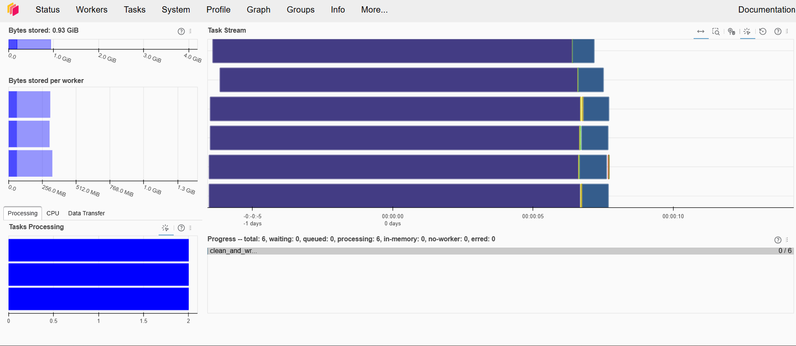

# dask_Ejercicio

Laboratorio de **Computación Distribuida con Dask, Docker & Prefect**: procesamiento
out-of-core de 1.000.000 de registros sucios (mojibake UTF-8, nulos, regex caótico) sobre un
clúster Docker de 1 scheduler + 3 workers, orquestado con Prefect.

## Arquitectura

- **`dask-scheduler`**: coordinador del DAG, expone el puerto `8786` (IPC) y `8787` (Dashboard).
- **`dask-worker-1/2/3`**: workers independientes (2 threads, 1.5 GB RAM c/u), solo accesibles
  en la red interna `dask-cluster-net`.
- **`prefect-server`**: servidor de orquestación de Prefect (API + Dashboard), expone el
  puerto `4200`. El flujo (`prefect_flow.py`), al correr dentro de `dask-scheduler`, reporta
  su ejecución ahí vía la variable de entorno `PREFECT_API_URL`.
- **`shared-data/`**: volumen montado en todos los contenedores, actúa como Data Lake local
  (`raw/` para los CSV crudos, `processed/` para el Parquet final).

## Requisitos

- Docker y Docker Compose.

## Uso

1. Construir y levantar el clúster:

```bash
docker compose up -d --build
```

2. Verificar los dos dashboards:
   - **Dask** (clúster de cómputo): http://localhost:8787 — deben aparecer los 3 workers
     conectados en la pestaña `/status`.
   - **Prefect** (orquestación de flujos): http://localhost:4200 — el servidor tarda unos
     segundos en levantar; si ves error de conexión, espera y recarga.

3. Generar el dataset sintético de 1.000.000 de filas sucias (particionado en 6 CSV):

```bash
docker compose exec dask-scheduler python generate_dirty_data.py
```

4. Ejecutar el flujo orquestado con Prefect (valida infraestructura, corre el DAG de
   limpieza distribuida en el clúster y aplica quality gates sobre el resultado). El delay
   artificial en `cleaning_pipeline.py` hace que el DAG tarde ~15-20 segundos, tiempo
   suficiente para observar ambos dashboards en vivo mientras corre:

```bash
docker compose exec dask-scheduler python prefect_flow.py
```

   Mientras corre, entra a http://localhost:4200/runs para ver el flow run `dask-cleaning-pipeline`
   en estado `Running`. Abre ese flow run y ve a su pestaña **Graph** (o **Timeline**): vas a ver
   `validate_infrastructure` → `validate_raw_data` → `reset_output_dataset` abrirse en **6 ramas
   paralelas** (`clean_partition-0` … `clean_partition-5`, una por cada archivo crudo, sometidas
   concurrentemente vía `.submit()`) que convergen en `quality_gate` — esos son los "hilos" de
   ejecución concurrentes de Prefect. En paralelo, http://localhost:8787/status muestra el Task
   Stream real distribuido entre los 3 workers de Dask (cada partición Prefect delega su cómputo
   pesado a un worker distinto del clúster).

5. El resultado limpio queda en `shared-data/processed/transactions_clean.parquet`, con las
   columnas `customer_code_clean`, `city_notes_clean` y `phone_clean`.

6. Detener el clúster:

```bash
docker compose down
```

## Uso de Prefect

Este proyecto corre un `prefect-server` propio (no el modo efímero por defecto), así que cada
corrida de `prefect_flow.py` queda registrada de forma persistente (volumen `prefect-data`) y se
puede inspeccionar en la UI incluso después de que termine, no solo mientras corre.

### Estructura del flujo

`prefect_flow.py` define un único `@flow` (`dask-cleaning-pipeline`) con estas `@task`:

| Task | Qué hace | Reintentos |
|---|---|---|
| `validate_infrastructure` | Verifica que el scheduler Dask esté vivo y con ≥1 worker conectado | 3 intentos, 5s de espera |
| `validate_raw_data` | Verifica que existan los 6 CSV crudos en `shared-data/raw/` | — |
| `reset_output_dataset` | Limpia el directorio Parquet de salida antes del fan-out | — |
| `clean_partition` (×6) | Limpia UNA partición y somete su cómputo al clúster Dask; las 6 se lanzan concurrentemente vía `.submit()` | 2 intentos, 10s de espera |
| `quality_gate` | Valida cardinalidad (1.000.000 filas) y proporción de anomalías (<20%) sobre el resultado consolidado | — |

### Navegar la UI (http://localhost:4200)

1. **Runs**: historial de corridas del flow `dask-cleaning-pipeline` — cada `python prefect_flow.py`
   agrega una nueva entrada, con nombre aleatorio (ej. `radical-tortoise`).
2. Haz clic en una corrida para ver su detalle:
   - **Graph**: el DAG del flow run. Corriendo el flujo vas a ver las 6 ramas paralelas de
     `clean_partition` abrirse entre `reset_output_dataset` y `quality_gate` (ver paso 4 de
     [Uso](#uso)).
   - **Logs**: la salida de `get_run_logger()` de cada task, con timestamps.
   - **Task Runs**: cada task con su estado (`Completed` / `Failed` / `AwaitingRetry`), duración
     y número de reintentos.

### Ver un reintento real en la UI

Para forzar que `validate_infrastructure` falle y reintente (en vez de solo leerlo en el código):

```bash
docker stop dask-scheduler
```

Como ya no puedes usar `docker compose exec` sobre un contenedor detenido, corre el flujo desde un
contenedor nuevo con `docker compose run`:

```bash
docker compose run --rm --no-deps dask-scheduler python prefect_flow.py
```

Vas a ver en los logs (y en la UI, pestaña **Task Runs** de esa corrida) que `validate_infrastructure`
falla tras ~10s con `OSError: Timed out trying to connect...` y Prefect lo marca `AwaitingRetry`
antes de reintentar (hasta 3 veces); como el scheduler sigue caído, el flow termina en `Failed`
tras el último intento — eso también es válido para observar el mecanismo de reintentos.

Al terminar la prueba, levanta el clúster de nuevo (deteniendo el scheduler también se detienen
los workers, porque pierden la conexión):

```bash
docker compose up -d
```

### CLI de Prefect (alternativa a la UI)

```bash
docker compose exec dask-scheduler prefect flow-run ls
docker compose exec dask-scheduler prefect flow-run logs <FLOW_RUN_ID>
```

### Probar tolerancia a fallos

Con el flujo en ejecución, en otra terminal:

```bash
docker stop dask-worker-2
```

Observa en el Dashboard cómo el scheduler reprograma las tareas del worker caído hacia
`dask-worker-1` y `dask-worker-3` (ver [ANALISIS.md](ANALISIS.md), pregunta 2).

## Archivos

| Archivo | Propósito |
|---|---|
| [`dockerfile`](dockerfile) | Imagen base compartida por scheduler y workers |
| [`docker-compose.yml`](docker-compose.yml) | Topología del clúster (red, volumen, límites de recursos) |
| [`requirements.txt`](requirements.txt) | Dependencias Python (Dask, Prefect, pandas, pyarrow) |
| [`generate_dirty_data.py`](generate_dirty_data.py) | Generador de 1.000.000 de filas sucias particionadas en 6 CSV |
| [`cleaning_pipeline.py`](cleaning_pipeline.py) | DAG de limpieza distribuida (regex, mojibake, teléfonos) sobre Dask |
| [`prefect_flow.py`](prefect_flow.py) | Orquestación (`@flow`/`@task`), fan-out concurrente por partición (`ConcurrentTaskRunner`), reintentos y quality gates |
| [`ANALISIS.md`](ANALISIS.md) | Respuestas a las preguntas de reflexión arquitectónica |

## Rúbrica de Evaluación

Mapeo de cada criterio del taller a su evidencia concreta en este repositorio:

| Criterio | Ponderación | Evidencia en este repo |
|---|---|---|
| **Infraestructura Docker y Clúster** | 20% | [`docker-compose.yml`](docker-compose.yml): 1 scheduler + 3 workers independientes, red `dask-cluster-net`, volumen `shared-data` compartido, límites de recursos (`cpus`/`mem_limit`) por contenedor. Capturas: [dashboard con 3 workers](#capturas-de-pantalla--evidencia). |
| **Script Generador y Datos Sucios** | 20% | [`generate_dirty_data.py`](generate_dirty_data.py): 1.000.000 de filas en 6 CSV, con mojibake, nulos y heterogeneidad regex inyectados probabilísticamente. |
| **Refactorización y Limpieza Dask** | 35% | [`cleaning_pipeline.py`](cleaning_pipeline.py): extracción regex a `CUST-XXXXX`/token de anomalía, reparación de mojibake UTF-8↔Latin-1, normalización de teléfonos, todo vía `map_partitions` distribuido y escrito a Parquet. |
| **Orquestación Prefect y Análisis** | 25% | [`prefect_flow.py`](prefect_flow.py): `@flow`/`@task` con reintentos, validación de infraestructura/datos, fan-out concurrente de 6 tasks (una por partición) visible como ramas paralelas en http://localhost:4200, y `quality_gate` con aserciones; [`ANALISIS.md`](ANALISIS.md): respuestas fundamentadas a las 4 preguntas arquitectónicas. |

## Capturas de Pantalla / Evidencia

Las capturas del Dashboard de Dask (http://localhost:8787) van en [`docs/screenshots/`](docs/screenshots/).
Sugerido, como mínimo:

1. **`01-cluster-status.png`** — pestaña `/status` con el scheduler y los 3 workers conectados (recursos, memoria) recién levantado el clúster (paso 2 del [Uso](#uso)).
2. **`02-task-stream.png`** — pestaña `/status` (Task Stream + Progress) capturada **mientras** corre `prefect_flow.py`, mostrando las tareas distribuidas entre los 3 workers.
3. **`03-worker-failure.png`** — pestaña `/status` justo después de `docker stop dask-worker-2`, mostrando solo 2 workers activos y las tareas reprogramadas (sección [Probar tolerancia a fallos](#probar-tolerancia-a-fallos)).
4. **`04-prefect-flow-graph.png`** — pestaña **Graph** del flow run en la UI de Prefect (http://localhost:4200/runs), idealmente capturada **mientras corre** (`Running`), mostrando las 6 ramas paralelas `clean_partition-0` … `clean_partition-5` abriéndose entre `reset_output_dataset` y `quality_gate`.

Para incluirlas en este README, guarda el archivo en `docs/screenshots/` y agrega una línea así (ajusta el nombre de archivo y el texto alternativo):

```markdown

```

> Tip: en Windows, `Win + Shift + S` abre el recorte de pantalla; guarda el PNG directamente en
> `docs\screenshots\` dentro de la carpeta del repo.
